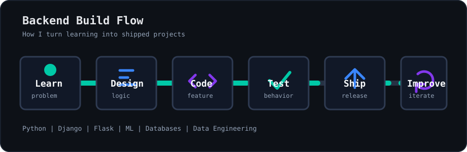

<div align="center">


<br />

<a href="https://github.com/Cherry013?tab=repositories">
  
</a>
<a href="https://www.linkedin.com/in/charan-reddy-dnvcr17503/">
  
</a>
<a href="https://github.com/Cherry013">
  
</a>

</div>

---

## Profile Summary

I am **Charan Reddy**, a Computer Science graduate and software developer focused on backend systems, database-backed applications, and practical machine learning projects.

I work mainly with **Python**, **Django**, **Flask**, **MySQL**, and machine learning workflows. My current direction is to build reliable REST APIs, improve system design fundamentals, and grow into data engineering with PySpark, Docker, and AWS.

<table>
  <tr>
    <td width="33%" align="center">
      <strong>Primary Focus</strong>
      <br />
      Backend Development
    </td>
    <td width="33%" align="center">
      <strong>Core Stack</strong>
      <br />
      Python, Django, Flask, MySQL
    </td>
    <td width="33%" align="center">
      <strong>Growing Into</strong>
      <br />
      Data Engineering, Cloud, System Design
    </td>
  </tr>
</table>

---

## Technical Toolkit

<div align="center">


</div>

<br />

| Area | Tools and Concepts |
|---|---|
| Backend | Django, Flask, REST APIs, routing, authentication, CRUD workflows |
| Programming | Python, Java, C, C++, clean logic, debugging, documentation |
| Databases | MySQL, schema basics, relational data modeling, query-driven features |
| Machine Learning | Image classification, preprocessing, model training, evaluation |
| Data and Cloud | PySpark basics, ETL thinking, Docker learning, AWS fundamentals |

---

## Featured Work

<table>
  <tr>
    <td width="50%">
      <h3>Plant Species Identification</h3>
      <p>Image classification project focused on identifying plant species through preprocessing, feature extraction, and model evaluation.</p>
      <p>
        
        
        
      </p>
    </td>
    <td width="50%">
      <h3>Image Classification System</h3>
      <p>Deep learning workflow for classifying images into multiple categories, with attention to training quality and model iteration.</p>
      <p>
        
        
      </p>
    </td>
  </tr>
  <tr>
    <td width="50%">
      <h3>Django Web Applications</h3>
      <p>Database-backed web applications with authentication, forms, CRUD features, template rendering, and maintainable backend structure.</p>
      <p>
        
        
        
        
      </p>
    </td>
    <td width="50%">
      <h3>Flask API Projects</h3>
      <p>Lightweight APIs and backend services built with Flask for routing, request handling, service logic, and structured responses.</p>
      <p>
        
        
      </p>
    </td>
  </tr>
</table>

<details>
  <summary><strong>What I focus on while building projects</strong></summary>
  <br />

| Practice | Why It Matters |
|---|---|
| Clear backend structure | Makes features easier to extend and debug |
| Database-backed thinking | Keeps applications practical and useful |
| Iterative improvement | Turns small projects into stronger systems |
| Documentation | Makes the project easier to understand and review |
| Testing mindset | Helps catch behavior issues before they grow |

</details>

---

## Contribution Lab

<div align="center">

<a href="https://github.com/Cherry013?tab=repositories">
  
</a>
<a href="https://github.com/Cherry013?tab=repositories&q=&type=&language=python&sort=">
  
</a>

<br />
<br />



</div>

<br />

<table>
  <tr>
    <td width="25%" align="center">
      <strong>Now Building</strong>
      <br />
      Django REST APIs
    </td>
    <td width="25%" align="center">
      <strong>Improving</strong>
      <br />
      Authentication and API structure
    </td>
    <td width="25%" align="center">
      <strong>Experimenting</strong>
      <br />
      ML image classification
    </td>
    <td width="25%" align="center">
      <strong>Next Upgrade</strong>
      <br />
      PySpark and AWS basics
    </td>
  </tr>
</table>

<details>
  <summary><strong>Current learning roadmap</strong></summary>
  <br />

```python
roadmap = {
    "backend": ["Django REST Framework", "API design", "authentication"],
    "data": ["PySpark", "ETL workflows", "data pipelines"],
    "cloud": ["Docker", "AWS basics", "deployment"],
    "engineering": ["system design", "clean code", "open source"]
}
```

</details>

---

## Strengths

| Strength | How It Shows Up |
|---|---|
| Practical backend thinking | I build around real data, routes, models, and user flows |
| Fast learner | I move from concept to small working project quickly |
| ML curiosity | I enjoy classification problems and model improvement cycles |
| Consistent improvement | I refine structure, naming, documentation, and reliability over time |

---

## Achievements

<div align="center">

| Achievement | Status |
|---|---|
| B.Tech in Computer Science | Completed |
| Python Certification | Completed |
| Java Certification | Completed |
| Salesforce Internship | Completed |
| Academic and Personal Projects | Built |

</div>

---

## Connect

<div align="center">

<a href="https://github.com/Cherry013">
  
</a>
<a href="https://www.linkedin.com/in/charan-reddy-dnvcr17503/">
  
</a>

<br />
<br />

```text
Learn -> Build -> Test -> Improve -> Ship
```

**Focused on backend development, practical machine learning, and building projects that become better with every version.**

</div>


