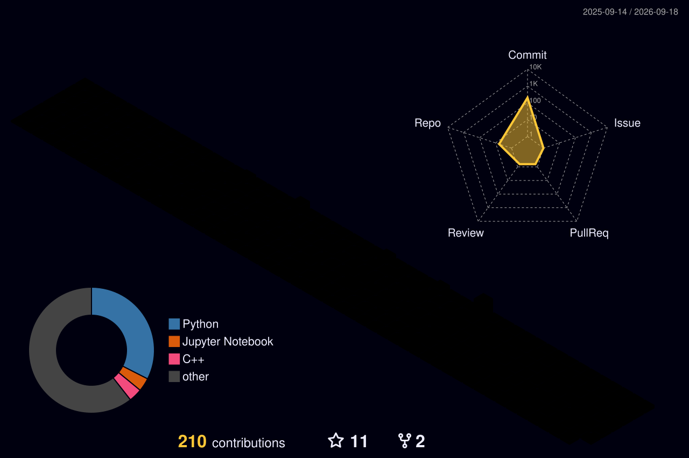

<div align="center">


<br />

<a href="https://github.com/Cherry013">
  
</a>
<a href="https://github.com/Cherry013">
  
</a>
<a href="https://github.com/Cherry013">
  
</a>

</div>

---

## About Me

I am **Charan Reddy**, a Computer Science graduate and software developer focused on building useful, practical applications with clean backend logic and data-driven features.

My work started with **Python** and grew into **Django**, **Flask**, **machine learning**, and database-backed web applications. I enjoy turning ideas into working projects, improving them step by step, and learning the engineering habits that make software reliable in the real world.

<br />

<table>
  <tr>
    <td width="50%">

### Developer Snapshot

```yaml
Name: Charan Reddy
Role: Software Developer
Education: B.Tech Computer Science
Location: India

Current Focus:
  - Backend Development
  - Django REST Framework
  - Machine Learning
  - Data Engineering
```

  </td>
  <td width="50%">

### What I Am Building Toward

```yaml
Goals:
  - Production-ready Django REST APIs
  - Stronger system design fundamentals
  - PySpark and data engineering workflows
  - AWS and cloud deployment skills
  - Open source contributions
```

  </td>
  </tr>
</table>

---

## Tech Stack

<div align="center">

### Languages


### Backend, Web & ML


### Databases, Tools & Platforms


### Currently Learning


</div>

---

## Skill Progress

<div align="center">

| Skill | Progress |
|---|---:|
| Python | ███████████████████ 95% |
| Django | █████████████████░░ 85% |
| Machine Learning | ████████████████░░░ 80% |
| Java | ███████████████░░░░ 75% |
| Data Engineering | ████████████░░░░░░░ 60% |
| Cloud Technologies | ███████░░░░░░░░░░░░ 35% |

</div>

---

## Featured Projects

<table>
  <tr>
    <td width="50%">
      <h3>Plant Species Identification</h3>
      <p>Machine learning application that identifies plant species from images using image classification techniques.</p>
      <p>
        
        
        
      </p>
    </td>
    <td width="50%">
      <h3>Image Classification System</h3>
      <p>Deep learning project designed to classify images into multiple categories with a model-focused workflow.</p>
      <p>
        
        
      </p>
    </td>
  </tr>
  <tr>
    <td width="50%">
      <h3>Django Web Applications</h3>
      <p>Full-stack web applications with authentication, database integration, CRUD features, and clean backend structure.</p>
      <p>
        
        
        
        
      </p>
    </td>
    <td width="50%">
      <h3>Flask Applications</h3>
      <p>REST APIs and lightweight backend services built with Flask and Python for simple, focused application logic.</p>
      <p>
        
        
      </p>
    </td>
  </tr>
</table>

---

## Current Roadmap

<table>
  <tr>
    <td>Build production-ready Django REST APIs</td>
    <td>In progress</td>
  </tr>
  <tr>
    <td>Master PySpark for data engineering</td>
    <td>Learning</td>
  </tr>
  <tr>
    <td>Learn AWS cloud services</td>
    <td>Learning</td>
  </tr>
  <tr>
    <td>Contribute to open source projects</td>
    <td>Goal</td>
  </tr>
  <tr>
    <td>Improve system design knowledge</td>
    <td>In progress</td>
  </tr>
  <tr>
    <td>Secure a software development role</td>
    <td>Primary goal</td>
  </tr>
</table>

---

## Contribution Lab

<div align="center">

<a href="https://github.com/Cherry013?tab=repositories">
  
</a>
<a href="https://github.com/Cherry013">
  
</a>

<br />
<br />



<br />
<br />


<br />
<br />

<table>
  <tr>
    <td align="center">
      <strong>Build Mode</strong>
      <br />
      Backend + ML
    </td>
    <td align="center">
      <strong>Current Loop</strong>
      <br />
      Learn -> Ship -> Improve
    </td>
    <td align="center">
      <strong>Profile Signal</strong>
      <br />
      Consistency over noise
    </td>
  </tr>
</table>

<br />
<br />

<picture>
  <source media="(prefers-color-scheme: dark)" srcset="./dist/github-contribution-grid-snake-dark.svg" />
  <source media="(prefers-color-scheme: light)" srcset="./dist/ocean-snake.svg" />
  
</picture>

<br />
<br />


</div>

---

## Achievements

<div align="center">

| Achievement | Status |
|---|---|
| B.Tech in Computer Science | Completed |
| Python Certification | Completed |
| Java Certification | Completed |
| Salesforce Internship | Completed |
| Academic and Personal Projects | Built |

</div>

---

## Currently Exploring

```python
learning = {
    "backend": ["Django REST Framework", "API design", "Authentication"],
    "data": ["PySpark", "Data Engineering", "ETL workflows"],
    "cloud": ["AWS", "Docker", "Deployment basics"],
    "engineering": ["System Design", "Clean Code", "Open Source"]
}
```

---

## Connect With Me

<div align="center">

<a href="https://github.com/Cherry013">
  
</a>
<a href="https://www.linkedin.com/in/charan-reddy-dnvcr17503/">
  
</a>

</div>

---

## Developer Philosophy

<div align="center">

```text
Learn -> Build -> Fail -> Improve -> Repeat
```


**Great software is built one commit at a time.**

</div>


